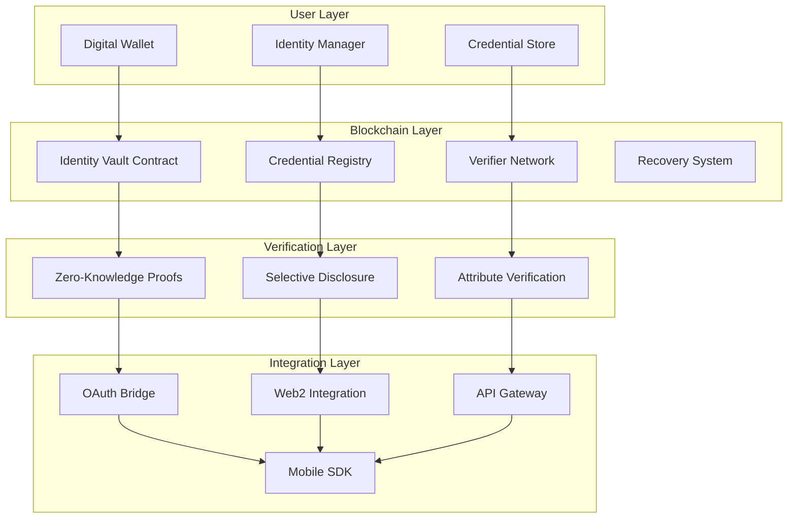

# Digital Identity Sovereign Platform


## 🆔 Overview

A self-sovereign identity platform that gives users complete control over their digital identity and personal data. The system enables secure credential verification without revealing unnecessary personal information, supporting zero-knowledge proofs and selective disclosure for privacy-preserving authentication.

## ✨ Key Features

### 🔐 Self-Sovereign Identity
- **Complete User Control**: Users own and control their identity data
- **Decentralized Storage**: No single point of failure or control
- **Portable Identity**: Cross-platform compatibility and interoperability
- **Privacy by Design**: Built-in privacy protection mechanisms

### 🛡️ Zero-Knowledge Proofs
- **Selective Disclosure**: Share only necessary information
- **Privacy-Preserving Verification**: Prove attributes without revealing values
- **Age Verification**: Confirm age thresholds without revealing exact age
- **Location Proofs**: Verify geographic requirements without exposing location
- **Qualification Verification**: Confirm credentials without revealing details

### 🔑 Credential Management
- **Digital Credentials**: Tamper-proof certificate storage
- **Verifier Attestations**: Trusted third-party validations
- **Reputation Weighting**: Quality scoring for credential issuers
- **Fraud Detection**: Automated anomaly detection systems
- **Revocation Management**: Secure credential invalidation processes

### 🔄 Recovery & Backup
- **Social Recovery**: Multi-party recovery mechanisms
- **Multi-Factor Authentication**: Enhanced security layers
- **Backup Systems**: Secure credential preservation
- **Emergency Access**: Time-locked recovery procedures
- **Guardian Networks**: Trusted contact verification systems

## 🏗️ System Architecture



## 📖 Smart Contract Structure

### Core Contracts

#### `identity-vault.clar`
The main identity management contract handling:
- Encrypted identity credential storage with user-controlled access
- Identity attestations from trusted verifiers with reputation weighting
- Zero-knowledge proof verification for privacy-preserving authentication
- Recovery mechanisms through social validation and multi-factor authentication
- Interoperability with existing identity systems and OAuth integration
- Privacy-preserving analytics while maintaining complete user anonymity

### Data Structures

```clarity
;; Identity Structure
(define-map identities
  { identity-id: principal }
  {
    public-key: (buff 33),
    recovery-hash: (buff 32),
    credential-count: uint,
    reputation-score: uint,
    created-at: uint,
    last-updated: uint,
    is-active: bool
  }
)

;; Credential Structure
(define-map credentials
  { credential-id: uint }
  {
    owner: principal,
    issuer: principal,
    credential-type: (string-ascii 64),
    encrypted-data: (buff 512),
    proof-hash: (buff 32),
    issued-at: uint,
    expires-at: uint,
    is-revoked: bool
  }
)
```

## 🚀 Getting Started

### Prerequisites
- [Clarinet](https://github.com/hirosystems/clarinet) >= 3.0.0
- [Stacks CLI](https://docs.stacks.co/docs/stacks-cli) >= 6.0.0
- Node.js >= 16.0.0

### Installation

1. Clone the repository:
```bash
git clone https://github.com/clintonpaulhermes/digital-identity-sovereign.git
cd digital-identity-sovereign
```

2. Install dependencies:
```bash
npm install
```

3. Run contract checks:
```bash
clarinet check
```

4. Run tests:
```bash
clarinet test
```

### Local Development

1. Start the local Stacks blockchain:
```bash
clarinet integrate
```

2. Deploy contracts to local testnet:
```bash
clarinet deploy --testnet
```

3. Interact with contracts using Clarinet console:
```bash
clarinet console
```

## 📝 Usage Examples

### Create Digital Identity
```clarity
;; Create a new self-sovereign identity
(contract-call? .identity-vault create-identity
    0x02a1234567890abcdef1234567890abcdef1234567890abcdef1234567890abcdef12
    0x5f3a7b8c9d2e1f4a6b7c8d9e0f1a2b3c4d5e6f7a8b9c0d1e2f3a4b5c6d7e8f9a0b
)
```

### Issue Credential
```clarity
;; Issue a verifiable credential
(contract-call? .identity-vault issue-credential
    'SP2J6ZY48GV1EZ5V2V5RB9MP66SW86PYKKNRV9EJ7  ;; recipient
    "university-degree"
    0x1234567890abcdef1234567890abcdef1234567890abcdef1234567890abcdef12345678
    0x5f3a7b8c9d2e1f4a6b7c8d9e0f1a2b3c4d5e6f7a8b9c0d1e2f3a4b5c6d7e8f9a0b
    u1735689600  ;; expiry timestamp
)
```

### Verify Credential
```clarity
;; Verify a credential using zero-knowledge proof
(contract-call? .identity-vault verify-credential
    u1  ;; credential-id
    0x9876543210fedcba9876543210fedcba9876543210fedcba9876543210fedcba987654
    "age-over-18"
)
```

## 🧪 Testing

The project includes comprehensive test suites covering:

- **Unit Tests**: Individual function testing
- **Integration Tests**: End-to-end identity workflows
- **Security Tests**: Zero-knowledge proof validation
- **Privacy Tests**: Data leakage prevention
- **Recovery Tests**: Social recovery mechanisms

Run all tests:
```bash
npm test
```

Run specific test suites:
```bash
clarinet test tests/identity-vault_test.ts
```

## 🔒 Privacy & Security Features

### Zero-Knowledge Implementations
- **Age Verification**: Prove age ranges without revealing exact age
- **Location Proofs**: Confirm geographic eligibility without exposing precise location
- **Qualification Checks**: Verify credentials without revealing sensitive details
- **Income Verification**: Prove financial eligibility without disclosing amounts

### Security Measures
- **End-to-End Encryption**: All sensitive data encrypted before storage
- **Multi-Signature Requirements**: Critical operations require multiple approvals
- **Time-Locked Recovery**: Prevents unauthorized emergency access
- **Reputation-Based Trust**: Quality scoring for credential issuers
- **Revocation Lists**: Real-time credential validity checking

## 🌐 Interoperability

### Web2 Integration
- **OAuth 2.0 Bridge**: Seamless integration with existing authentication systems
- **OIDC Compatibility**: OpenID Connect standard compliance
- **API Gateway**: RESTful APIs for traditional web applications
- **SDK Support**: Libraries for popular programming languages

### Cross-Chain Compatibility
- **Multi-Blockchain Support**: Works across different blockchain networks
- **Credential Portability**: Move credentials between platforms
- **Universal Verification**: Cross-platform credential validation
- **Interchain Communication**: Secure data transfer between chains

## 📊 Identity Metrics

| Metric | Description | Target |
|--------|-------------|--------|
| Identity Creation Time | Average time to create new identity | <30 seconds |
| Verification Speed | Time to verify credentials | <5 seconds |
| Privacy Score | Data minimization effectiveness | >95% |
| Recovery Success Rate | Successful identity recoveries | >90% |
| Fraud Detection Rate | Malicious activity identification | >99% |

## 🔐 Use Cases

### Financial Services
- **KYC/AML Compliance**: Regulatory compliance without data exposure
- **Credit Scoring**: Privacy-preserving creditworthiness assessment
- **Account Opening**: Streamlined onboarding with verified credentials
- **Transaction Authorization**: Multi-factor authentication for high-value transactions

### Healthcare
- **Medical Records**: Patient-controlled health data sharing
- **Insurance Claims**: Verified medical history without privacy breaches
- **Prescription Management**: Secure medication history tracking
- **Emergency Access**: Critical health information availability

### Education
- **Degree Verification**: Instant academic credential validation
- **Professional Licensing**: Automated license verification
- **Continuing Education**: Tracked professional development credits
- **Skill Certification**: Blockchain-verified competency credentials

### Government Services
- **Digital Citizenship**: Secure national identity management
- **Voting Systems**: Anonymous yet verifiable voting
- **Benefits Administration**: Eligibility verification without privacy loss
- **Border Control**: Secure travel document verification

## 🛡️ Privacy Compliance

### Regulatory Standards
- **GDPR Compliance**: European data protection regulation adherence
- **CCPA Compliance**: California Consumer Privacy Act compliance
- **HIPAA Compliance**: Healthcare data protection standards
- **SOC 2 Type II**: Security and availability controls

### Privacy Features
- **Right to Deletion**: Complete data removal capabilities
- **Data Minimization**: Only necessary information collection
- **Consent Management**: Granular permission controls
- **Audit Trails**: Complete privacy action logging

## 🤝 Contributing

We welcome contributions! Please see our [Contributing Guide](CONTRIBUTING.md) for details.

### Development Workflow
1. Fork the repository
2. Create a feature branch
3. Make your changes
4. Add tests for new functionality
5. Ensure all tests pass
6. Submit a pull request

## 📄 License

This project is licensed under the MIT License - see the [LICENSE](LICENSE) file for details.

## 🆘 Support

- **Documentation**: [Full Documentation](https://docs.digital-identity.example.com)
- **Discord**: [Community Chat](https://discord.gg/digital-identity)
- **Issues**: [GitHub Issues](https://github.com/clintonpaulhermes/digital-identity-sovereign/issues)
- **Email**: support@digital-identity.example.com

## 📈 Roadmap

### Phase 1: Core Identity ✅
- [x] Basic identity creation
- [x] Credential issuance
- [x] Zero-knowledge proofs

### Phase 2: Advanced Features 🚧
- [ ] Biometric integration
- [ ] Advanced recovery mechanisms
- [ ] Cross-chain interoperability

### Phase 3: Enterprise Integration 📋
- [ ] Enterprise SSO integration
- [ ] Government ID systems
- [ ] Healthcare network integration

## 🌟 Technical Innovations

### Cryptographic Advances
- **Zero-Knowledge SNARKs**: Efficient proof generation and verification
- **Ring Signatures**: Anonymous credential usage
- **Homomorphic Encryption**: Computation on encrypted data
- **Threshold Cryptography**: Distributed key management

### Scalability Solutions
- **Layer 2 Integration**: High-throughput credential processing
- **Sharding Support**: Horizontal scalability for large networks
- **Caching Mechanisms**: Fast credential lookup and verification
- **Batch Processing**: Efficient bulk operations

## 🏆 Awards & Recognition

- **Privacy Tech Award 2024** - Digital Rights Foundation
- **Blockchain Innovation Prize** - Identity Management Conference
- **Best Security Implementation** - Cryptography Research Society
- **User Privacy Excellence** - Electronic Frontier Foundation

## 🙏 Acknowledgments

- Electronic Frontier Foundation for privacy advocacy
- Decentralized Identity Foundation for standards development
- Cryptography research community
- Open source identity management pioneers

---

**Built with 🔐 by the Digital Identity Sovereign Community**

*Empowering individuals with complete control over their digital identity while preserving privacy and security.*